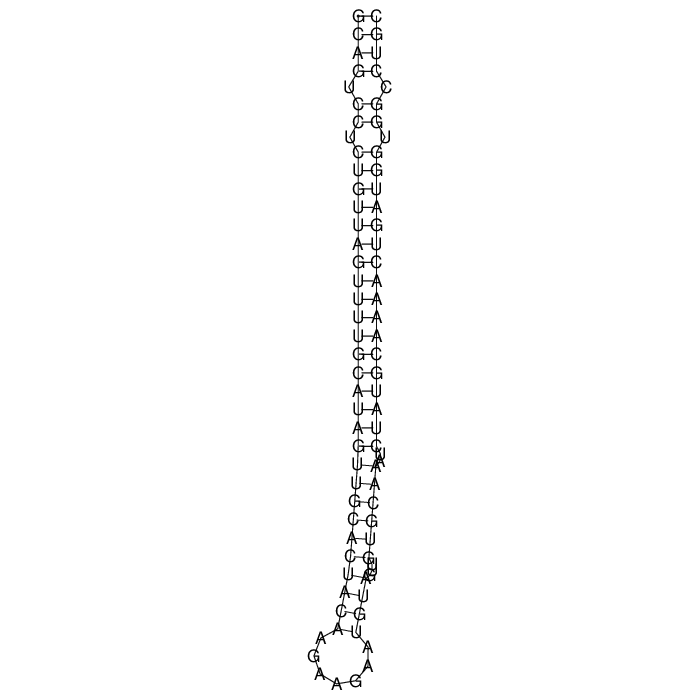

```{r setup, include=FALSE}
library(ggplot2)
library(foreign)
library(gridExtra)
knitr::opts_chunk$set(fig.pos = "h")
knitr::opts_chunk$set(echo = FALSE)

if(exists("snakemake")){
  df=read.csv(snakemake@input["finalcsv"])
}else{
  df=read.arff("2018-2-11-1-20-56.arff")
}

featplot <- function(featname){
  plot <-ggplot(df, aes_string(x=featname, fill="class",color="class"))+geom_density(alpha=0.4)+ggtitle(featname)
  return(plot)
}
```

# Einleitung

## Micro RNA

- Kleines, **nicht codierendes** RNA Molekül, welches man in Pflanzen, Tieren und Viren findet
- Ca. *22 Nukleotide* groß
- Lagert sich an komplementäre messenger RNA: **posttranskriptionale Regulation der Genexpression**
- Verhindert die Anlagerung an die Ribosomen: **keine Proteinbiosynthese** 
  
[@stanley]

## Motivation

- Micro RNAs (**miRNA**) als Kern von Biochips
   - Vorhersage von Lungenkrebs und MS! [@mirnadiag]
- Bestimmte miRNAs wirken **krebsfördernd** (oncomiRs) [@Kooshapur2018]
- Problem: Erkennung von *echten* pre-miRNA Kandidaten
- Ziel: Ein Klassifikationsmodell für die pre-miRNA Kandidaten zu erstellen und **sinnvolle** Features auszuwählen 

## Machine Learning

- Anwendung von künstlicher Intelligenz
  - Möglichkeit des **Lernens** anhand von Testdaten
- Verschiedene Machine Learning (ML) Methoden:
  - *Supervised ML*:
    - Alle Zielwerte der Daten eines Testdatensatzes sind gegeben und der Algorithmus lernt anhand dieser die Struktur
  - *Unsupervised ML*:
    - Hier sind die Ergebnisse für die Testdaten nicht gegeben und der Algorithmus muss selber eine Strukturierung erkennen, mit der er neue Daten bewerten kann

# Projektphasen

## GitHub


https://github.com/OstfriesenBI/PredmiRNA

- Öffentliche einsehbare Git Repositories(Repos)
- Web GUI, Issue Tracker, Team Collaboration etc.
- GitHub Profil als Portofolio eines Entwicklers
- Reproduktion: `git clone` & `snakemake --use-conda report`


## Phase 1 - Done

- Vorbereitung der Features
  - Inhalt/Aussage der einzelnen Features
  - Verstehen der Berechnung
  - Planung des Outputs
  - Existierende Programme
- Schreiben der einzelnen Skripte für die Features

## Phase 2 - (almost) Done

- Einbindung der Skripte in den Workflow (Snakemake)
  - Sequenzen -> Ergebnisse der einzelnen Features
- Visualisierung der Daten

## Phase 3 - WIP

- Training der Modelle zeigt ein Overfitting
  - Modelle zeigen **90%** Richtigkeit (Accuracy) bei *10-Faltung* Kreuzvalidierung und einer geschichteten Zufallsstichprobe mit je 1500 Sequenzen 
  - Modelle gewichten biologisch unsinnige Features wie Standardabweichung von 3 verschieden erstellten Permutationen 
- -> **Dimensionsreduktion** durchführen
- Schreiben eines Reports


# Feature Beispiele

## Was ist ein Feature?
  ![[@feature]](resources/feature.png)
  
 - Ein **Feature** ist eine Eigenschaft einer Datenausprägung
 - Die Verknüpfung von vielen **sinnvollen** Features ist notwendig um auf ein gutes Ergebnis mit ML zu kommen
 - Verringerung der Daten auf wenige leichter handhabbare Features um besser mit ihnen weiter arbeiten zu können
 
## Minimum Free Energy
 - Stabilste Sekundärstruktur nach dem Algorithmus von Zuker -> geringstes Energieniveau
 - Funktionsweise: Aufsummierung der negativen Basenstapelkräfte
 - Nicht unbedingt die in-vivo Struktur
 - Reprästiert als "Dot-Bracket notation"
 
 [ViennaRNA @rnafold]
 
## Beispiel Faltung hsa-mir-19a
```
GCAGUCCUCUGUUAGUUUUGCAUA
GUUGCACUACAAGAAGAAUGUAGU
UGUGCAAAUCUAUGCAAAACUGAU
GGUGGCCUGC
```
Wird zu
```
((((.((.((((((((((((((((((((
(((((((.......))))...)))))).
.))))))))))))))))).)).))))
```
---


## Dichteverteilung der MFE
```{r mfe, eval=T, echo=F}
featplot("MFEI1")
```

## Minimum Free Energy Index 1
 - MFE alleine ist ein kein gutes Feature
 - Das gleiche gilt für den GC Gehalt
 - Wenn man die MFE durch den GC Gehalt dividiert, erhält man ein besseres Feature -> $MFEI_1$
 
$$
MFEI_1=\frac{MFE}{GC%}
$$

## Dichteverteilung der MFEI1
```{r mfei1, eval=T, echo=F}
mfe<-featplot("ddG")
gc<-featplot("gc_content")
mfei1<-featplot("MFEI1")
grid.arrange(mfe, gc, mfei1,layout_matrix=rbind(c(1,2),c(3,3)))
```


# Verwendete Tools

## Conda


- Problem in der Bioinformatik: Viele Tools, die von verschiedenen Libraries/anderen Tools abhängen
- Conda ist ein Packagemanager vergleichbar wie apt
- Unabhängig von dem Systempfaden verwendbar

## Python


- Intepretierte, High-Level, Allzweck-Programmiersprache
- Readability
- Genutzt für: Web development, software development, scientific computing
- Einfache Syntax ähnlich zur englischen Sprache
- Aktuell wichtige Rolle in Data Science und Bioinformatik

## R


- Programmiersprache und kostenlose Software Enviroment für statistische Berechnungen und Grafiken 
- Wird benutzt von Statistikern und Data Minern um Software für Daten Analysen zu entwickeln


## Snakemake


- Snakemake ist ein auf Python basierendes Workflow-Management-Tool
- Ein Workflow beinhaltet einen Satz an Regeln
- Eine Regel ist eine Beschreibung, wie aus Input-Files Output-Files zu erzeugen sind
- Dadurch können Ergebnisse von einem Programm an ein anderes weitergegeben werden

[@snakemake]

## WeKa 
_logo.png)

- Sammlung von ML Algorithmen für Data Mining Augaben
- Die Algorithmen können entweder direkt auf die Daten angewendet werden oder in einem Java Programm aufgrufen
-  Weka beinhaltet Tools zur Daten-Vorbereitung, Klassifizierung, Regression, Clustering und Visualisierung

[@weka]


# Anhang

## Beispiel Regeln
``` python
rule fold:
	input:
		basedir+"/{inputgroup}/split/{inputgroup}.fasta_chunk_{index}"
	output:
		basedir+"/{inputgroup}/fold/{index}.fold"
	shadow:
		"shallow" # Run it in an isolated enviroment
	conda: "envs/rnafold.yaml"
	shell:
		"RNAfold --noPS -p < {input} > {output}"
rule parsernafold:
	input:
		rules.fold.output
	output:
		basedir+"/{inputgroup}/datasplit/{index}.fold.csv"
	script:
		"scripts/rnafold2csv/rnafold2csv.py"
```

## Snakemake Workflow


## Literatur 1

Hall, Mark, Eibe Frank, Geoffrey Holmes, Bernhard Pfahringer, Peter Reutemann, and Ian H. Witten. 2009. “The WEKA Data Mining Software.” ACM SIGKDD Explorations Newsletter 11 (1): 10. https://doi.org/10.1145/1656274.1656278.
Hofacker, I. L. 2003. “Vienna RNA Secondary Structure Server.” Nucleic Acids Research 31 (13): 3429–31. https://doi.org/10.1093/nar/gkg599.

Kooshapur, Hamed, Nila Roy Choudhury, Bernd Simon, Max Mühlbauer, Alexander Jussupow, Noemi Fernandez, Alisha N. Jones, et al. 2018. “Structural Basis for Terminal Loop Recognition and Stimulation of Pri-miRNA-18a Processing by hnRNP A1.” Nature Communications 9 (1). https://doi.org/10.1038/s41467-018-04871-9.

## Literatur 2

Köster, Johannes, and Sven Rahmann. 2018. “Snakemake—a scalable bioinformatics workflow engine.” Bioinformatics 34 (20): 3600–3600. https://doi.org/10.1093/bioinformatics/bty350.

Ng, Kwang Loong Stanley, and Santosh K. Mishra. 2007. “De novo SVM classification of precursor microRNAs from genomic pseudo hairpins using global and intrinsic folding measures.” Bioinformatics 23 (11): 1321–30. https://doi.org/10.1093/bioinformatics/btm026.

## Literatur 3

Stähler, Peer. 2010. “Molekulare Diagnoseverfahren: miRNA-Biomarker im Blut.” Dtsch Arztebl International 107 (10): A–454 –. http://www.aerzteblatt.de/int/article.asp?id=68103.

## <ignore me>