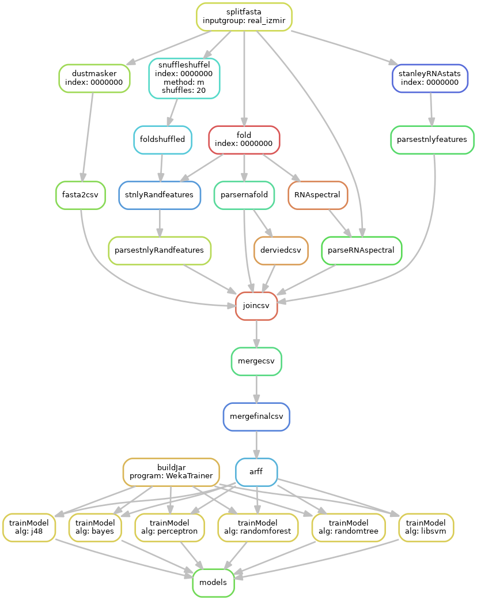

```{r setup, include=FALSE}
library(ggplot2)
library(foreign)
library(gridExtra)
knitr::opts_chunk$set(echo = FALSE)
featplot <- function(featname){
  df <- read.arff("2018-2-11-1-20-56.arff");
  plot <-ggplot(df, aes_string(x=featname, fill="class",color="class"))+geom_density(alpha=0.4)+ggtitle(featname)
  return(plot)
}
```

# Einleitung

## Micro RNA

- Kleines, **nicht codierendes** RNA Molekül, welches man in 
- In Pflanzen, Tieren oder Viren vorzufinden
- Ca. *22 Nukleotide* groß
- Lagert sich an komplementäre messenger RNA: **posttranskriptionale Regulation der Genexpression**
- Verhindert die Anlagerung an die Ribosomen: **keine Proteinbiosynthese** 
  
[@stanley]

## Motivation

- Micro RNAs (**miRNA**) als Herz von Biochips
   - Vorhersage von Lungenkrebs und MS! [@mirnadiag]
- Bestimmte miRNAs wirken **krebsfördernd** (oncomiRs) [@Kooshapur2018]
- Daher ML als Ansatz zur Erkennung von *echten* pre-miRNA Kandidaten
- Ziel: Ein Klassifikationsmodell für die pre-miRNA Kandidaten zu erstellen und **sinnvolle** Features auswählen 

## Machine Learning

- Anwendung von künstlicher Intelligenz
  - Möglichkeit des **Lernens** anhand von Testdaten
- Verschiedene Machine Learning (ML) Methoden:
  - *Supervised ML*:
    - Alle Ergebnisse der Daten eines Testdatensatzes sind gegeben
  - *Unsupervised ML*:
    - Hier sind die Ergebnisse für die Testdaten nicht gegeben und der Algorithmus muss selber eine Struktur erkennen/lernen, wodurch er neue Daten bewerten kann

# Projektphasen

## Phase 1 - Done

- Vorbereitung der Features
  - Inhalt/Aussage der einzelnen Features
  - Verstehen der Berechnung
  - Planung des Outputs
  - Mögliche Tools zur Vereinfachung
- Schreiben der einzelnen Skripte für die Features

## Phase 2 - (almost) Done

- Einbindung der Skripte in den Workflow (Snakemake)
  - Testdaten -> Ergebnisse der einzelnen Features
- Visualisierung der Daten

## Phase 3 - WIP

- Training der Modelle zeigt ein Overfitting
- Dimensionsreduktion für die Features durchführen
- Schreiben eines Reports


# Feature Beispiele

## Minimum Free Energy
 - Randfold berechnet die thermodynamisch stabilste Sekundärstruktur nach dem Algorithmus von Zuker
 - Reprästiert als "Dot-Bracket notation"
 - Aufsummierung der negativen Basenstapelkräfte
 
 [ViennaRNA @rnafold]
 
## Beispiel Faltung hsa-mir-19a
```
GCAGUCCUCUGUUAGUUUUGCAUA
GUUGCACUACAAGAAGAAUGUAGU
UGUGCAAAUCUAUGCAAAACUGAU
GGUGGCCUGC
```
Wird zu
```
((((.((.((((((((((((((((((((
(((((((.......))))...)))))).
.))))))))))))))))).)).))))
```
---


## Dichteverteilung der MFE
```{r mfe, eval=T, echo=F}
featplot("MFEI1")
```

## Minimum Free Energy Index 1
 - MFE alleine ist ein nicht so gutes Feature
 - Das gleiche gilt für den GC Gehalt
 - Wenn man die MFE durch den GC Gehalt dividiert, erhält man ein besseres Feature
$$
MFEI_1=\frac{MFE}{GC%}
$$

## Dichteverteilung der MFEI1
```{r mfei1, eval=T, echo=F}
mfe<-featplot("ddG")
gc<-featplot("gc_content")
mfei1<-featplot("MFEI1")
grid.arrange(mfe, gc, mfei1,layout_matrix=rbind(c(1,2),c(3,3)))
```


# Verwendete Tools

## GitHub
https://github.com/OstfriesenBI/PredmiRNA

- Öffentliche einsehbare Git Repos
- Tooling mit Web GUI and Issue Tracker z. B.
- GitHub Profil als Portofolio eines Entwicklers
- Reproduktion: git clone, snakemake report, DONE!

## Snakemake
- Snakemake ist ein auf Python basierendes Workflow-Management-Tool
- Ein Workflow beinhaltet ein Satz an Regeln
- Eine Regel ist eine Beschreibung, wie aus einem Input-File ein Output-File zu erzeugen ist
- Dadurch können Ergebnisse von einem Skript an ein anderes weitergegeben werden
- Erweiterung des Python Syntaxes
[@snakemake]

## Beispiel Regeln
``` python
rule fold:
	input: basedir+"/{ingroup}/split/{ingroup}.fasta_chunk_{index}"
	output:	basedir+"/{ingroup}/fold/{index}.fold"
	conda: "envs/rnafold.yaml"
	shadow:	"shallow" # Run in temp dir, copy results
	shell: "RNAfold --noPS -p < {input} > {output}"
rule parsernafold:
	input: rules.fold.output
	output: basedir+"/{ingroup}/datasplit/{index}.fold.csv"
	script: "scripts/rnafold2csv/rnafold2csv.py"
```

## WeKa

- Sammlung von ML Algorithmen für Data Mining Augaben
- Die Algorithmen können entweder direkt auf die Daten angewendet werden oder in einem Java Programm aufgrufen werden
-  Weka beinhaltet Tools zur Daten-Vorbereitung, Klassifizierung, Regression, Clustering und Visualisierung
[@weka]

## Python

- Intepretierte, High-Level, Allzweck-Programmiersprache
- Readability
- Genutzt für: Web development, software development, mathematics, system scripting
- Einfache Syntax ähnlich zur englischen Sprache
- Benutzt neue Linien anstelle von z.B. Semikolons

## R
- Programmiersprache und kostenlose Software Enviroment für statistische Berechnungen und Grafiken 
- Wird benutzt von Statistiker und Data Miner um statistische Software und Daten Analysen zu entwickeln

## Conda
- Problem in der Bioinformatik: Viele Tools, die von verschiedenen Libraries/anderen Tools abhängen
- Conda ist ein Packagemanager vergleichbar wie apt, aber versatiler als pip

# Vorläufige Ergebnisse

## Snakemake Workflow


## References {.allowframebrakes}

